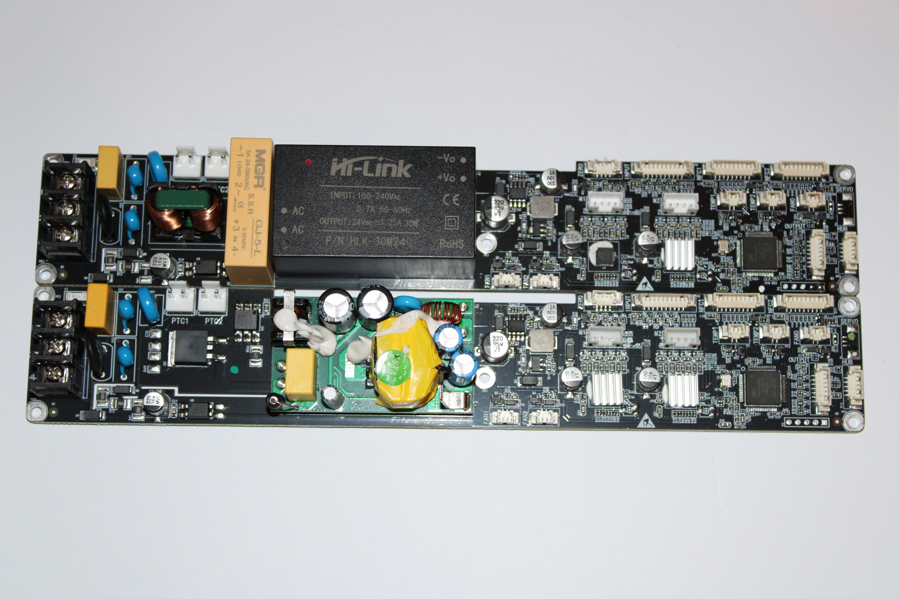
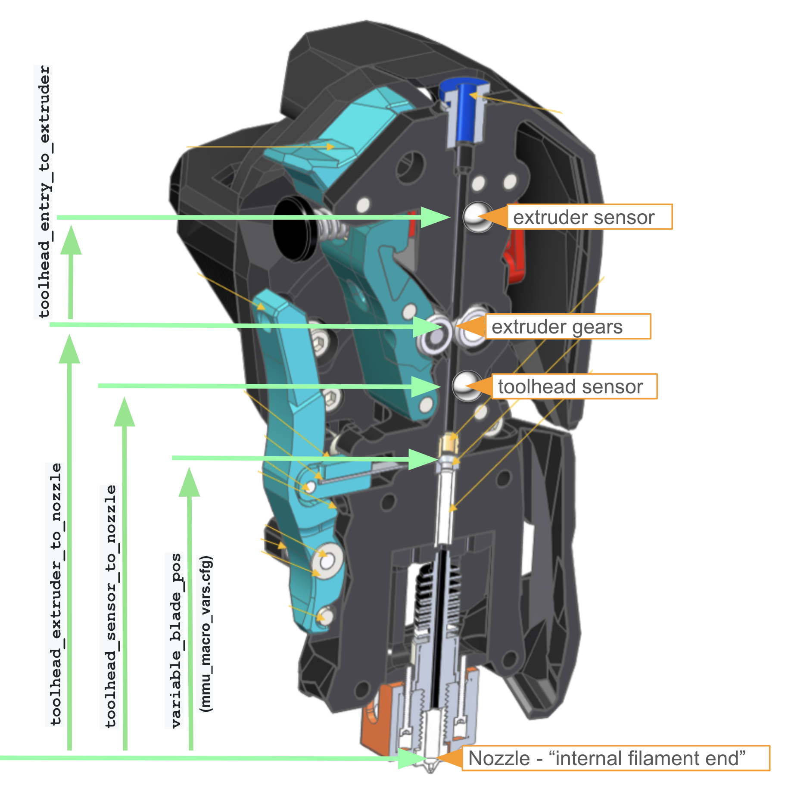

# ACE Pro 硬件底层资料

本文档整理 Anycubic Color Engine Pro 的主板硬件信息，来源：
- [saturnechek/conversion-of-anycubic-ace-pro-to-happy-hare](https://github.com/saturnechek/conversion-of-anycubic-ace-pro-to-happy-hare)（刷 Klipper 替换固件方案，完整暴露了引脚）
- 社区逆向工程记录

SolisACE **保留原厂固件**，通过 USB 串口 JSON 协议与 ACE 通信，不修改硬件。本文档作为底层参考，用于理解固件行为与引脚对应关系。

---

## 主板版本

| 版本 | 电源结构 | 加热控制 | 备注 |
|------|---------|---------|------|
| 0.0.8 | 封闭式电源 | 固态继电器 | 加热元件 110V 额定 |
| 0.0.9 | 开放式电源 | 晶体管控制 | 引脚布局略有差异 |




主板引脚图（saturnechek 社区提供）：
> 以下引脚以 0.0.8 主板为准。


---

## 主控芯片

**GD32F303** 微控制器（国产 STM32F303 兼容），Cortex-M4，72MHz。

SWD 调试接口引出（3 针：GND / SWDIO / SWCLK），可通过 ST-Link v2 进行固件烧写。

---

## 完整引脚表

> **来源标记**：标 ★照片实测 的章节为高清主板照片（FilamentBox_V0.0.8 丝印）逐针核对，最可靠。未标记的（步进电机、加热温控）来自 saturnechek 的 Klipper 改装配置，尚未与照片逐针核对，可能有出入。

### 步进电机（来自 saturnechek 配置，未照片核对）

| 功能 | 引脚 |
|------|------|
| 选择器 STEP | PD2 |
| 选择器 DIR | !PB3（反向） |
| 送料轮 STEP | PB4 |
| 送料轮 DIR | PB5 |
| 两个步进共用 ENABLE | !PA1（低有效） |
| 选择器归零开关 | PA15 |
| 选择器 TMC2208 UART | PA3 |
| 送料轮 TMC2208 UART | PA10 |

两个电机驱动均为 **TMC2208**（UART 配置），运行电流 0.8A，微步：选择器 16 细分，送料轮 32 细分。选择器 `rotation_distance = 40`，送料轮 `rotation_distance = 2`（对应 Bondtech 5mm 摩擦轮的实际线速度）。

### INPUT 连接器（输入侧到料检测 + 指示灯）★照片实测

主板 **INPUT** 端口连接输入检测 PCB。**单个连接器同时承载 4 路光电传感器和 4 个 LED**：

| 引脚 | 功能 |
|------|------|
| PA4 | 通道 0 光电传感器 |
| PA5 | 通道 1 光电传感器 |
| PC4 | 通道 2 光电传感器 |
| PC5 | 通道 3 光电传感器 |
| PB10 | 通道 0 LED |
| PB11 | 通道 1 LED |
| PA14 | 通道 2 LED |
| PA13 | 通道 3 LED |
| VCC / GND | 电源 |

这是**料盘输入侧**（不是"料槽出口"）的到料检测：每个料盘插入口一个**光电**传感器（非机械开关），检测该通道是否插了耗材。对应 ACEResearch："four channels (one for each filament reel) which each have an optical sensor and indicator led"。

### OUTPUT 连接器（缓冲器霍尔，耗材运动检测）★照片实测

主板 **OUTPUT** 端口连接缓冲器子板 **OUTPUT_V0.4**。缓冲器每路有 **2 个霍尔效应传感器 + 1 个磁铁**，4 路共 **8 霍尔 / 4 磁铁**，检测耗材是否真的在移动（运动 + 方向，类似正交编码）。

OUTPUT 连接器为 **7 针**（丝印实测）：

| 引脚 | 板载丝印 |
|------|---------|
| GND | 电源地 |
| VCC | 电源 |
| PC13 | 信号 |
| PC14 | 信号 |
| PC15 | 信号 |
| （另 2 针） | **板上无丝印** — 待万用表确认（NC / 重复电源 / 未标信号） |

8 个霍尔由 OUTPUT_V0.4 子板本地处理后经这几根线上报主板。

> ⚠️ **PC15 更正**：PC15 是 **OUTPUT 缓冲连接器**的一员（与 PC13/PC14 同组），**不是**挤出机入口传感器。早期版本误把 PC15 当作 `filament_sensor`，实为照搬 saturnechek 的 Klipper 改装接线（他们把挤出机传感器焊到了 OUTPUT 端口的空脚上）。原厂板上 PC15 = 缓冲霍尔接口。

> **与 `feed_assist_count` 的关系（修正）**：`feed_assist_count` 最可能来自**这里的缓冲器霍尔运动检测**（OUTPUT，PC13/14/15），而非输入侧光电。送料时耗材带动缓冲器磁铁移动、霍尔产生脉冲计数；耗材到位卡住、缓冲器不再移动时计数停止。这才是"送料是否真在走"的真实来源。

### 加热与温控

| 功能 | 引脚 |
|------|------|
| 加热器控制（watermark PWM） | PA0 |
| 风扇 0 | PA7 |
| 风扇 1 | PA6 |
| 风扇 2 | PB7 |
| 温度传感器 0（区域 0/1） | PC2 |
| 温度传感器 1（区域 2/3） | PC3 |

热敏电阻型号：Generic 3950，4 个独立加热区通过 SSR/晶体管驱动（0.0.8 为 SSR）。

> ACE Pro 加热元件额定 110V。若在 220V 地区使用非原厂供电，需特别注意安全。

> 指示灯（PB10/PB11/PA14/PA13）并非独立连接器，已与光电传感器一起整合在上面的 **INPUT 连接器**中。

### 其他连接器 ★照片实测

| 连接器（丝印） | 引脚 | 功能 |
|------|------|------|
| ZERO | PA15, PC10 | 选择器归零开关 |
| NFC1 | VCC, GND, PB13, PB14, PB15, PC7, PC8 | RFID 读头 1 |
| NFC2 | VCC, GND, PB13, PB14, PB15, PC6, PC8, PA9 | RFID 读头 2 |
| HUB | GND, PB2(BOOT1), PA11(USB D-), PA12(USB D+) | USB Hub（部分未贴装 не распаяно） |
| SERVO | — | 空贴未用 |

### 外部接口（机壳 MX3.0）★实测

ACE 机壳引出两个 MX3.0 端子，均走 USB，但**方向相反**：

| 接口 | USB 方向 | 针脚（参考） | 用途 |
|------|---------|------------|------|
| **6P** | device（从机 / 上行） | 24V / GND / D- / D+ /（+2 针未知） | 接主机（打印机或 Klipper 上位机），枚举为 `/dev/serial/by-id/usb-ANYCUBIC_ACE_1-if00` |
| **4P** | host（主机 / 下行） | 3.5V / GND / D- / D+ | 串联下一台 ACE（本台 4P → 下台 6P） |

ACE 的 MCU（GD32）以 **USB device** 身份出现，故只有 **6P** 能被上位机枚举。**4P 是主机侧下行口**，插到上位机时两个 host 对插、中间无 device → **搜不到设备**（实测：用 4P 在 Ubuntu 上找不到 `/dev/serial/by-id/usb-ANYCUBIC_ACE_*`，6P 正常）。

板内 **HUB 连接器**（PA11/PA12）是这套的核心：ACE 内置 USB hub，一根线接主机的同时还能往下串联。官方信号线即 **6P（ACE 从机端）↔ 4P（打印机主机端）**。

> 6P 的第 5/6 针、4P 的 3.5V 具体功能尚未逐针实测；上表电压/针位综合自 README 实记与 ACEResearch，待万用表逐针核对。USB 主/从方向由"4P 插上位机不枚举、6P 枚举"实测确认。

---

## ACE Pro 内部机械结构

```
 [料盘0]   [料盘1]   [料盘2]   [料盘3]	    ← 插入后默认自动送料
    |         |         |         |		    【料盘入口开始送至800mm（从缓冲器尾部开始450mm）】
  [PA4]     [PA5]     [PC4]     [PC5]	  ← INPUT 光电（各通道到料检测）
  [PB10]    [PB11]    [PA14]    [PA13]	  ← LED（检测到-常亮，未检测到-闪烁）
    |         |         |         |
               [旋转选择器]				 ← 步进 PD2/PB3，归零 PA15（一次对准一路）
                 [送料轮]				   ← 步进 PB4/PB5，TMC2208
    |         |         |         |
 [缓冲0]----[缓冲1]----[缓冲2]----[缓冲3]   ← 4 个独立缓冲器，每路 2 霍尔 + 1 磁铁
    :         :         :         :         （共 8 霍尔 / 4 磁铁，OUTPUT PC13/14/15
    |         |         |         |        → feed_assist_count）
    +---------+---------+---------+
            [5 合 1 耗材集线器]             ← 4 路 ACE + 1 路预留（暂未用，备扩第 2 台 ACE）= 5 入 1 出
                   |
                [编码器]                   ← 外置 ITR20403，耗材运动计量
                   |
                   → 导管 → 打印机挤出机
```

每个料盘通道独立：到料光电（PA4/PA5/PC4/PC5）→ **旋转选择器**（归零 PA15，一次对准一路）→ **送料轮**驱动 → 该通道**独立缓冲器**（各 2 霍尔 + 1 磁铁，检测该路耗材运动）。插入耗材后 ACE 固件默认自动送料，**4 根耗材都会送出各自缓冲器并各预留一段**停在待命位。

4 路 ACE 通道在 **5 合 1 耗材集线器**汇为单路输出，经外置**编码器**（ITR20403）计量，最后由导管送入打印机挤出机。

> **第 5 路（预留口）**：当前不接、不参与换色。构想用于**未来扩展第二台 ACE 实例**——届时第 2 台 ACE 的输出接入此口（数据侧走 6P/4P 串联：本台 4P → 第 2 台 6P）。目前仅作机械预留，软件未实现。

---

## 外置编码器（DIY，可选）

SolisACE 的编码器计量/打滑检测功能用一个**自制光电编码器**，装在 **5 合 1 集线器之后的单路上**（测合并后的耗材运动，4 路 ACE + 预留路都能计量）。原是为 Happy Hare 多色做的，现复用于 SolisACE。

### 物料

| 件 | 规格 |
|----|------|
| 光电传感器 | **ITR20403**（槽型光遮断器） |
| 贴片电阻（0603） | 220R / 1K / 2K2 / 100K |
| 指示灯 | 0603 贴片 LED |
| 测量轮 | **BMG 齿轮**（抓取耗材） |
| 码盘 | 直径 **20mm**、**25 齿**，与 BMG 同轴 |

耗材带动 BMG 齿轮转，同轴 25 齿码盘的齿缝经过 ITR20403 槽口产生脉冲。**PCB 自带 100K 上拉 + 信号调理**。

### 分辨率

```
BMG 抓取每转送丝 ≈ 23.6mm（有效抓取直径 ≈ 7.5mm）
单边沿：23.6 ÷ 25 齿              ≈ 0.944 mm/脉冲
双边沿：23.6 ÷ 25 ÷ 2            ≈ 0.472 mm/脉冲   ← SolisACE 默认 encoder_resolution
```

> 20mm 码盘直径只决定齿的物理大小，**与分辨率无关**；分辨率 = 每转送丝 ÷ 齿数（÷2 双边沿）。

### 接线（到打印机主板，非 ACE 板）

| 编码器脚 | 接 |
|---------|----|
| V | 3.3V |
| G | GND |
| S | 主板信号引脚（SolisACE 默认 **PA2**，Spider v2.3 的 Y-MAX） |

> Klipper 配置用 **`~PA2`（波浪号，禁用内部上拉）**，不要用 `^PA2`——PCB 已有 100K 外部上拉，再叠内部上拉会拉偏电平。对应 `ace.cfg` 的 `encoder_pin: ~PA2`。

---

## 挤出机侧结构与两阶段同步几何

ACE 输出的耗材经导管进入打印机挤出机。SolisACE 的**两阶段同步送料/回退**功能依赖挤出机两侧各一个耗材传感器。下图以 BMG/CW2 类挤出机为例（本项目的 Voron Trident 使用 CW2）：



### 传感器位置映射

沿耗材前进方向（导管 → 喷嘴）：

| 物理位置 | 图中标注 | SolisACE 配置项 | 角色 |
|---------|---------|----------------|------|
| 齿轮上游（入口） | extruder sensor | `filament_sensor` | 传感器1 |
| 挤出齿轮 | extruder gears | — | 同步驱动点 |
| 齿轮下游（喷嘴侧） | toolhead sensor | `filament_sensor_2` | 传感器2 |
| 切刀位 | variable blade pos | （`cut.cfg`） | 切断点 |
| 喷嘴 | nozzle | — | 耗材内部终点 |

> 关键几何：**传感器1在齿轮上游，传感器2在齿轮下游**。耗材是否"穿过齿轮"由两个传感器的状态共同界定。

### 两阶段同步逻辑（与几何对应）

**送料（进料）**

```
Phase 1  ACE 单独送料 → 传感器1 触发（耗材到达齿轮入口）
Phase 2  ACE + 挤出机同步 → 传感器2 触发（耗材穿过齿轮到达下游）
落座     feed_assist 计数稳定
冲刷     _ACE_POST_TOOLCHANGE 冲刷：推出旧色 + 上一刀留在喷嘴的残料头
```

**回退（卸料，对称）**

```
前置     _ACE_PRE_TOOLCHANGE 调用切刀宏【原位切断，不预回退】
         （回退熔融料头易堵喷嘴，故在位切断；残料头留待装新料后冲刷推出）
开始     传感器2 有料（切断点在传感器2下游，故仍有料）
Phase 2  ACE + 挤出机同步回退 → 传感器1 清除（耗材退出齿轮）
收尾     ACE 单独回退剩余距离（必须退过 5合1 集线器）→ 料槽 ready
```

单靠 ACE 无法把耗材推过/拉过 CW2 紧齿轮，故 Phase 2 必须由挤出机参与驱动；只有完全脱离齿轮后（传感器1清除）才交还 ACE 单独处理。

### `toolchange_retract_length` 的标定

参考 [Happy Hare 的 toolhead 距离参数](https://github.com/moggieuk/Happy-Hare/wiki/Happy-Hare-Parameters#---toolhead-loading--unloading)：

| HH 参数 | 含义 | CW2 典型值 |
|---------|------|-----------|
| `toolhead_extruder_to_nozzle` | 挤出齿轮 → 喷嘴尖 | ~72mm |
| `toolhead_sensor_to_nozzle` | 传感器2 → 喷嘴尖 | ~62mm |
| `toolhead_entry_to_extruder` | 传感器1 → 挤出齿轮 | ~8mm |

SolisACE 的 `toolchange_retract_length` 标定公式：

```
toolchange_retract_length ≈ 切断点（blade_pos，约喷嘴上方 37.5mm）
                          → 挤出齿轮 → ACE 输出（经导管）
                          → 退过【5合1 集线器汇合点】的全程
```

> 本流程**原位切断、不预回退**（回退熔融料头易堵喷嘴），故同步回退起点是紧贴喷嘴上方的切断点，**不扣除任何预回退量**。最关键是末段必须退过 5合1 集线器，否则下一卷在共享导管里撞料。装新料后由 `_ACE_POST_TOOLCHANGE` **冲刷**推出喷嘴里的旧色与残料头。

---

## 与 Happy Hare 方案的对比

| 维度 | SolisACE | saturnechek/Happy Hare |
|------|---------|----------------------|
| ACE 固件 | 保留原厂 | 完全替换为 Klipper |
| 接口 | USB 串口 JSON 协议 | Klipper 直接控制步进 |
| 到位检测 | 轮询 `feed_assist_count`（固件黑盒） | 物理传感器 homing move（精确） |
| 与挤出机同步 | G-code 队列串行化（协议级） | `sync_to_extruder` 硬件步进同步 |
| 可逆性 | 完全可逆 | 需刷回原厂固件（0.0.8 有风险） |
| 适用人群 | 保留原厂体验，仅做 Klipper 集成 | 深度改造，完整 MMU 控制 |

---

## 参考资料

- [saturnechek 项目 README（俄语）](https://github.com/saturnechek/conversion-of-anycubic-ace-pro-to-happy-hare)
- [BunnyACE](https://github.com/bushing/bunnyace)
- [ValgACE](https://github.com/agrloki/ValgACE)（SolisACE 上游）
- [Happy Hare](https://github.com/moggieuk/Happy-Hare)

*最后更新：2026-06-25（按高清主板照片 + 实机逐项校正：INPUT/OUTPUT 连接器实测、更正 PC15 归属与 feed_assist_count 推断、重画内部机械结构（4 独立缓冲 / 5 合 1 集线器 / 编码器）、新增外部接口 6P/4P USB 主从方向说明）*
